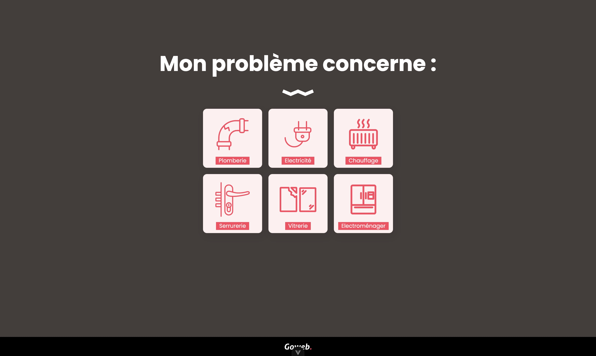

# Repair Form

This app will help you qualify your repair worksite by providing a dynamic question-and-answer system. You can describe your needs precisely and get quick assistance.

## Key Features
- Interactive Form: The form is dynamic and adjusts based on user inputs, ensuring a smooth and user-friendly experience.
- Validation: The application includes validation rules to ensure that all necessary information is provided accurately.
- Real-time Feedback: Users receive immediate feedback if they miss any required fields or enter invalid data.
- Data Storage: Once the form is completed, the data is stored in a MongoDB database for further processing and contact.

## Technical Details
### Frontend
- Vue.js: The frontend of the application is built using Vue.js, a progressive JavaScript framework for building user interfaces.
### Backend
- Express.js: The backend is built using Express.js, a minimal and flexible Node.js web application framework.
- MongoDB: The application uses MongoDB for data storage. The database stores all the form data submitted by users.